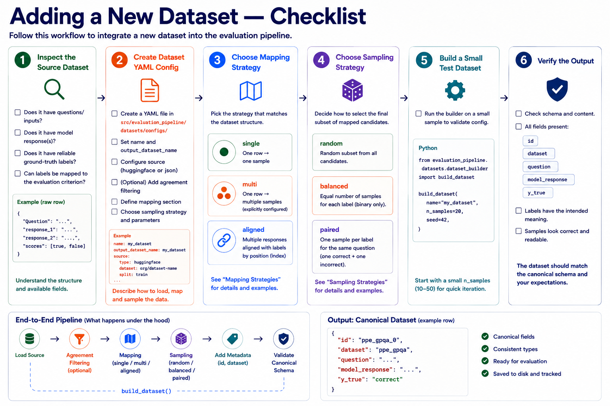

# Adding a Dataset

Datasets are integrated through YAML configuration files and converted to a common evaluation format:

```text
id
dataset
question
model_response
y_true
```

Dataset-specific logic should be described in the configuration whenever possible.

The pipeline supports three mapping strategies:

- `single` — one source row produces one evaluation sample
- `multi` — one source row produces multiple explicitly configured evaluation samples
- `aligned` — multiple responses in a source row are aligned with corresponding labels

## Before You Start

Inspect the source dataset and verify that it provides:

- [ ] a question or input
- [ ] one or more model responses
- [ ] a reliable ground-truth label
- [ ] labels that can be mapped to the intended evaluation criterion

Then choose the mapping strategy that matches the structure of the source dataset.

## 1. Create a Configuration

Create a YAML file in:

```text
src/evaluation_pipeline/datasets/configs/
```

Choose a mapping strategy based on the structure of the source dataset.

### Single Mapping

Use `single` when one source row corresponds to one evaluation sample:

```yaml
name: my_dataset
output_dataset_name: my_dataset

source:
  type: huggingface
  dataset: organization/dataset-name
  split: train

mapping:
  type: single

  question:
    source: prompt

  model_response:
    source: response

  y_true:
    source: label

sampling:
  strategy: random
```

`question`, `model_response`, and `y_true` are mapped from fields of the original dataset.

`id` and `dataset` are added automatically.

## 2. Mapping Options

### Label Mapping

Use `values` when source labels need to be converted to evaluation labels:

```yaml
y_true:
  source: is_safe
  values:
    true: safe
    false: not_safe
```

For example, a source value of `true` is converted to `safe`.

### Static Values

Use `value` when a field should have a fixed value:

```yaml
y_true:
  value: truthful
```

### Selecting an Element by Index

Use `index` when the source field contains a list and one element should be selected:

```yaml
model_response:
  source: incorrect_answers
  index: 0
```

This selects the first element of `incorrect_answers`.

### Including Additional Fields

Additional source fields can be appended to a mapped field using `include`:

```yaml
question:
  source: Question
  include:
    - choices
```

List values are formatted as lettered options:

```text
A. ...
B. ...
C. ...
D. ...
```

This is useful for multiple-choice datasets where the answer choices must be part of the question shown to the evaluator.

## 3. Mapping Strategies

### Single Mapping

Use `single` when each source row produces exactly one evaluation sample:

```yaml
mapping:
  type: single

  question:
    source: prompt

  model_response:
    source: response

  y_true:
    source: label
```

### Multi Mapping

Use `multi` when one source row should produce multiple explicitly configured evaluation samples:

```yaml
mapping:
  type: multi

  samples:
    - question:
        source: question

      model_response:
        source: best_answer

      y_true:
        value: truthful

    - question:
        source: question

      model_response:
        source: incorrect_answers
        index: 0

      y_true:
        value: not_truthful
```

For example, the same question can produce one truthful and one non-truthful evaluation sample.

### Aligned Mapping

Use `aligned` when one source row contains multiple responses and a corresponding list of labels:

```yaml
mapping:
  type: aligned

  question:
    source: Question
    include:
      - choices

  responses:
    prefix: response_

  labels:
    source: scores
    values:
      true: correct
      false: incorrect
```

Responses matching the configured prefix are aligned with the corresponding entries in the label list by position.

For example:

```text
response_1 ↔ scores[0]
response_2 ↔ scores[1]
response_3 ↔ scores[2]
```

Each response-label pair becomes a separate evaluation sample. The mapping step does not select which samples are kept; that is handled by the sampling strategy.

## 4. Optional Filtering

### Annotator Agreement

If multiple annotations must agree:

```yaml
agreement:
  fields:
    - human_0
    - human_1
    - human_2
```

Only rows with identical values in all specified fields are used.

## 5. Sampling Strategies

Sampling is applied after mapping and determines which mapped candidates are included in the final prepared dataset.

### Random Sampling

For standard random sampling:

```yaml
sampling:
  strategy: random
```

Samples are selected randomly from all mapped candidates.

### Balanced Sampling

Use balanced sampling for an equal number of samples from two labels:

```yaml
sampling:
  strategy: balanced
```

For example, `n_samples=100` produces 50 randomly selected samples from each label.

Balanced sampling requires exactly two labels, an even `n_samples`, and enough samples from each label.

### Paired Sampling

Use paired sampling when both labels should be represented for the same question:

```yaml
sampling:
  strategy: paired
```

Candidates are grouped by question. Each selected question contributes one randomly selected sample from each label.

For example, with:

```text
correct
incorrect
```

each selected question contributes one `correct` and one `incorrect` response.

`n_samples` must therefore be even. There must also be enough questions containing both labels.

## 6. Supported Sources

### Hugging Face

```yaml
source:
  type: huggingface
  dataset: organization/dataset-name
  subset: optional-subset
  split: train
```

### JSON

```yaml
source:
  type: json
  path: data/my_dataset.json
  url: https://example.com/my_dataset.json
```

If the local JSON file does not exist and `url` is provided, it is downloaded automatically.

## 7. Build the Dataset

No dataset-specific code is required in the notebook:

```python
dataset = build_dataset(
    name="my_dataset",
    n_samples=100,
    seed=42,
)
```

The pipeline automatically:

1. loads the source dataset,
2. applies optional agreement filtering,
3. maps source rows using the configured mapping strategy,
4. applies the configured sampling strategy,
5. adds `id` and `dataset`,
6. validates the canonical dataset structure.

The resulting dataset follows the canonical format:

```json
{
  "id": "my_dataset_0",
  "dataset": "my_dataset",
  "question": "...",
  "model_response": "...",
  "y_true": "..."
}
```

## Adding New Behavior

Prefer expressing dataset-specific structure through the YAML configuration.

Before adding Python code, check whether the dataset fits one of the existing mapping strategies:

```text
single   → one row, one sample
multi    → one row, multiple explicitly configured samples
aligned  → multiple responses aligned with multiple labels
```

Also check whether the required sample selection can be expressed using one of the existing sampling strategies:

```text
random    → random subset of mapped candidates
balanced  → equal number of samples from two labels
paired    → one sample per label for the same question
```

Avoid dataset-specific conditions such as:

```python
if name == "my_dataset":
    ...
```

Extend the generic mapping or sampling strategies only when the required behavior cannot be expressed by the existing configuration.



