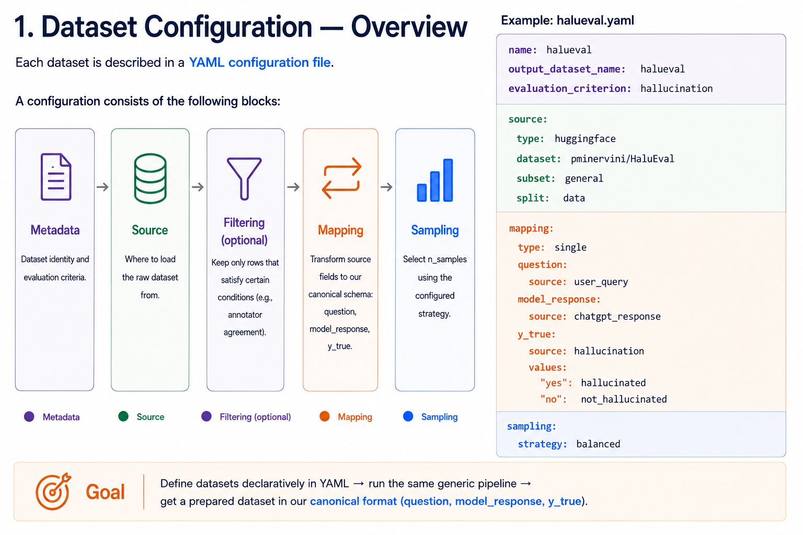
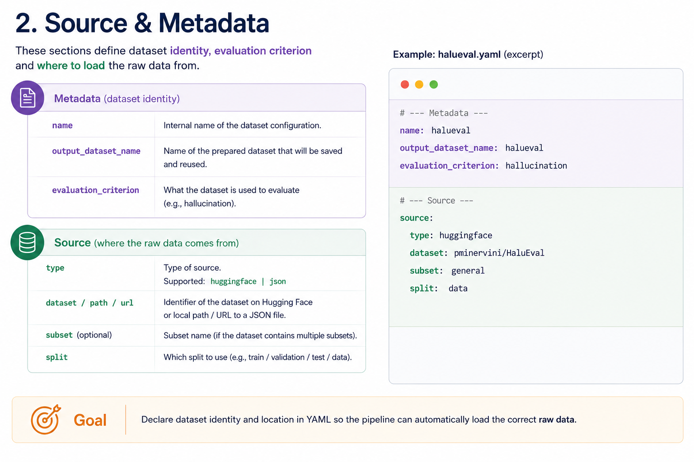
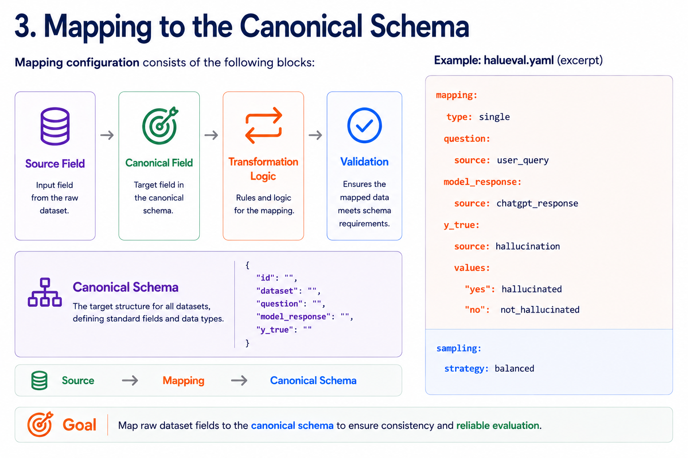
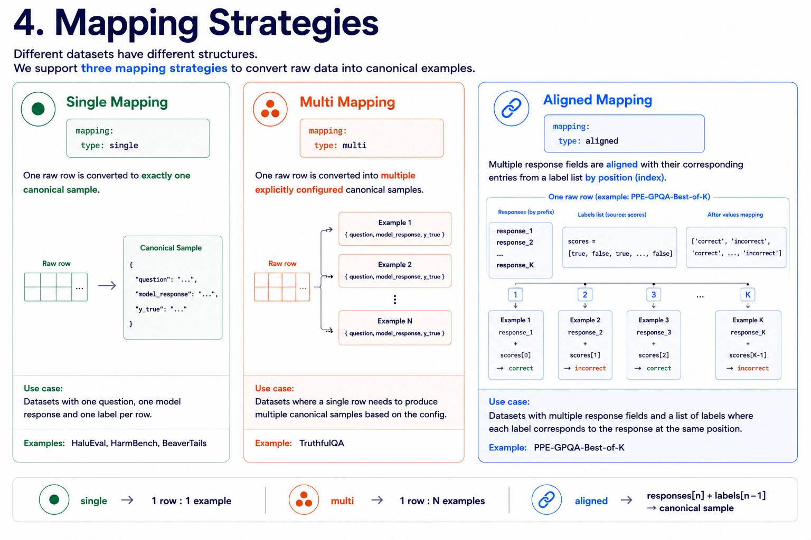
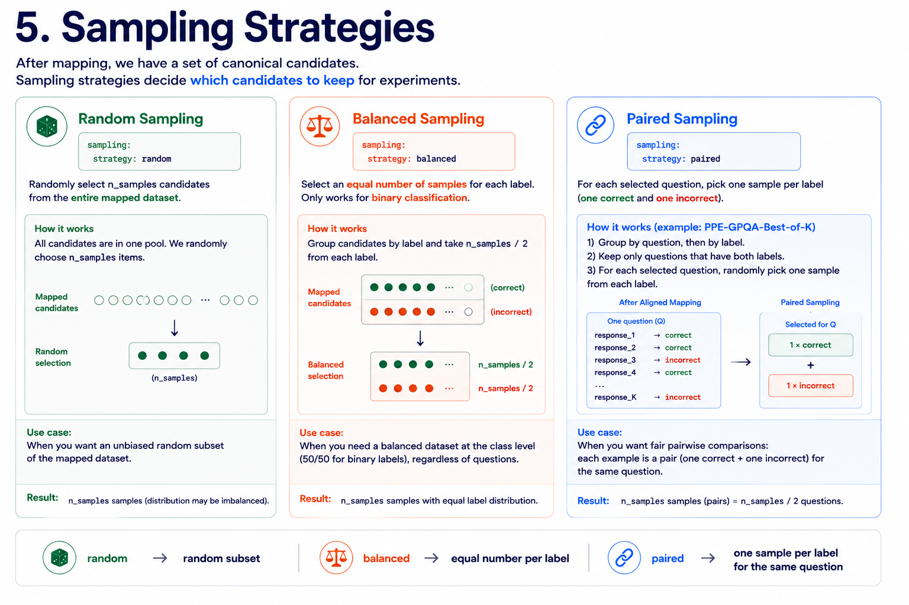
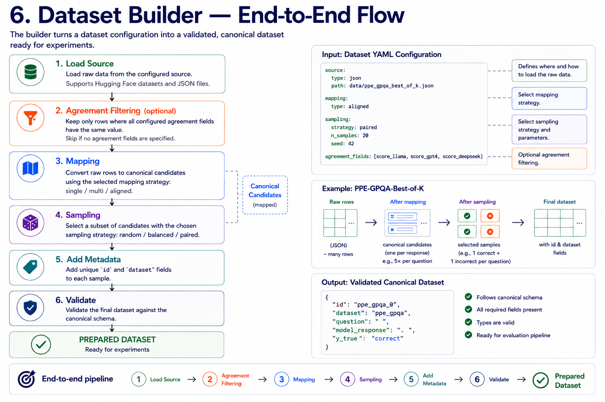

# Dataset Preparation Pipeline

## Overview

## Dataset Configuration

## Data Sources

## Filtering (optional)

ToDo

## Mapping to Canonical Schema

## Mapping Strategies

## Sampling

## Dataset Builder — End-to-End Flow

